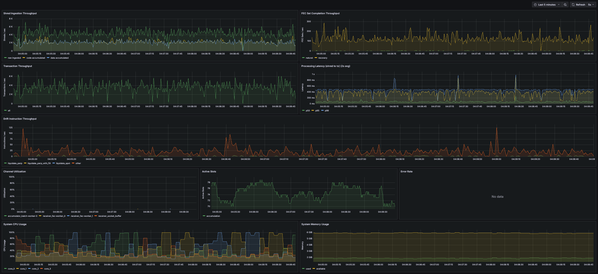
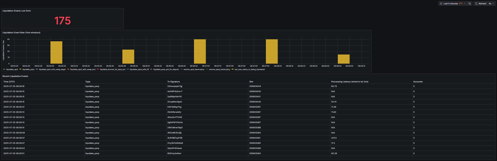

# unshred
Reconstructs Solana transactions from shreds in real time.
* Ingests shreds via UDP
* Parallelizes processing across Forward Error Correction (FEC) sets and entry batches
* Processes transactions via user-provided handlers
* Provides optional Prometheus metrics for system performance monitoring

## Quick start
```rust
use anyhow::Result;
use unshred::{TransactionEvent, TransactionHandler, UnshredProcessor};

struct MyHandler;

impl TransactionHandler for MyHandler {
    fn handle_transaction(&self, event: &TransactionEvent) -> Result<()> {
        println!("Slot {}: {} with {} instructions",
            event.slot,
            event.signature,
            event.transaction.message.instructions().len()
        );
        Ok(())
    }
}

#[tokio::main]
async fn main() -> Result<()> {
    let processor = UnshredProcessor::builder()
        .handler(MyHandler)
        .bind_address("0.0.0.0:8001")
        .build()?;

    processor.run().await
}
```

## Complete example
See `examples/drift-monitor` for a production-ready implementation that:
* Filters transactions for Drift protocol liquidation events
* Stores events in ClickHouse
* Tracks system performance metrics with Prometheus
* Generates Grafana dashboards for liquidation and system monitoring
* Packages all components into a docker-compose deployment





### Metrics
The example demonstrates the activation of the internal metrics for `unshred`:
1. `features = ["metrics"]` in `Cargo.toml`
2. `UnshredProcessor::builder().metrics_registry(registry)` to init

## API
### TransactionHandler
```rust
pub trait TransactionHandler: Send + Sync + 'static {
    /// Called for each reconstructed transaction
    /// # Returns
    /// * `Ok(())` to continue processing
    /// * `Err(_)` to log error and continue (does not stop processing)
    fn handle_transaction(&self, event: &TransactionEvent) -> Result<()>;
}
```

### TransactionEvent
```rust
pub struct TransactionEvent<'a> {
    pub slot: u64,
    pub signature: String,
    pub transaction: &'a VersionedTransaction,
    /// * `Some(_)` if the data shred that contained this transaction was directly received
    /// * `None`    if the data shred that contained this transaction was recovered via code shreds
    ///
    /// Note: Estimated as the received_at_micros of the data shred that contained
    ///       the first byte of the Entry that contained this transaction.
    pub received_at_micros: Option<u64>,
    pub processed_at_micros: u64,
    pub confirmed: bool,
}
```
